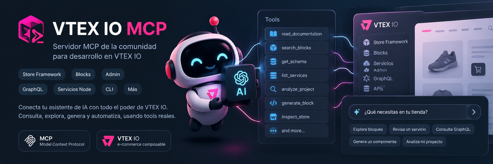

# vtex-io-mcp

**Servidor MCP para desarrollar en VTEX IO: Store Framework, React, servicios Node, GraphQL, Admin y más.**

`vtex-io-mcp` es un servidor [Model Context Protocol](https://modelcontextprotocol.io/) que convierte a tu asistente de IA en un copiloto de VTEX IO. Genera el _scaffolding_ de apps, servicios Node y esquemas GraphQL, consulta las props de los blocks de Store Framework y busca en una base de documentación y cursos que viaja dentro del paquete. Funciona con Claude Code, Claude Desktop, Cursor, VS Code, Windsurf y cualquier cliente MCP.

[](https://www.npmjs.com/package/vtex-io-mcp)
[](https://nodejs.org)
[](./LICENSE)

---

## Características

- **Scaffolding de apps VTEX IO**: `manifest.json` y estructura de carpetas para cualquier combinación de builders.
- **Backend listo para empezar**: servicio Node con `service.json`, clients, rutas HTTP y handlers de eventos; esquema GraphQL con resolvers tipados.
- **Store Framework**: props, ejemplos y generación de JSONC validado para los blocks del catálogo.
- **Documentación sin salir del editor**: 391 documentos de VTEX y 10 cursos oficiales con búsqueda por palabras clave.
- **Local y sin credenciales**: todo el conocimiento va en el paquete; no llama a APIs externas ni pide claves.

## Instalación

El cliente MCP ejecuta el servidor bajo demanda con `npx`, así que no hace falta instalarlo. Requiere Node `>= 18`.

### Claude Code

```bash
claude mcp add vtex-io -- npx -y vtex-io-mcp
```

Para compartirlo con el equipo en un repositorio, usa `--scope project`: la configuración queda en `.mcp.json`.

### Claude Desktop

En `claude_desktop_config.json` (macOS: `~/Library/Application Support/Claude/`, Windows: `%APPDATA%\Claude\`):

```json
{
  "mcpServers": {
    "vtex-io": {
      "command": "npx",
      "args": ["-y", "vtex-io-mcp"]
    }
  }
}
```

### Cursor

En `~/.cursor/mcp.json` (global) o `.cursor/mcp.json` (por proyecto):

```json
{
  "mcpServers": {
    "vtex-io": {
      "command": "npx",
      "args": ["-y", "vtex-io-mcp"]
    }
  }
}
```

### VS Code

En `.vscode/mcp.json`:

```json
{
  "servers": {
    "vtex-io": {
      "type": "stdio",
      "command": "npx",
      "args": ["-y", "vtex-io-mcp"]
    }
  }
}
```

### Windsurf

En `~/.codeium/windsurf/mcp_config.json`:

```json
{
  "mcpServers": {
    "vtex-io": {
      "command": "npx",
      "args": ["-y", "vtex-io-mcp"]
    }
  }
}
```

### Otros clientes

Cualquier cliente con transporte `stdio` sirve: el comando es `npx` y los argumentos, `-y vtex-io-mcp`. Si prefieres una instalación global, `npm install -g vtex-io-mcp` y usa `vtex-io-mcp` como comando.

## Uso

Después de reiniciar el cliente, pide lo que necesitas en lenguaje natural y el asistente elige la herramienta:

- "Crea una app VTEX IO llamada `product-reviews` con los builders react, node, graphql y store"
- "¿Qué props acepta el `flex-layout.row`? Dame un ejemplo con dos columnas"
- "Genera un servicio Node con una ruta pública `GET /_v/order/:orderId` y un handler para `order.created`"
- "Arma el esquema GraphQL con una query `productReviews(productId: ID!)` y una mutation `addReview`"
- "Busca en la documentación cómo funcionan las CSS Handles"
- "¿Qué endpoints tiene la API de Master Data?"

## Herramientas

### Apps y backend

| herramienta | parámetros | qué hace |
| --- | --- | --- |
| `scaffold-vtex-app` | `appName`, `vendor`, `builders`, `version?`, `description?` | Genera `manifest.json` y la estructura de carpetas de los builders elegidos: `store`, `react`, `node`, `graphql`, `styles`, `messages`, `admin`, `pixel`, `docs`. |
| `scaffold-node-service` | `appName`, `vendor`, `routes?`, `events?`, `memory?`, `timeout?` | Genera `node/index.ts`, `service.json`, clients y middlewares. Cada ruta lleva `name`, `path`, `method` y `public`; cada evento, `name`, `sender` y `keys`. |
| `scaffold-graphql` | `appName`, `vendor`, `queries?`, `mutations?` | Genera `schema.graphql` y los resolvers en TypeScript, con argumentos, tipo de retorno y descripción. |

### Store Framework

| herramienta | parámetros | qué hace |
| --- | --- | --- |
| `lookup-block-props` | `blockName` | Devuelve descripción, props y ejemplos de un block. |
| `add-block` | `blockName`, `blockId?`, `props?`, `children?` | Genera un fragmento JSONC para `blocks.jsonc` y valida las props contra el esquema del block. |

Blocks disponibles hoy: `rich-text`, `info-card`, `flex-layout.row`, `flex-layout.col`, `shelf`, `image`.

### Documentación

| herramienta | parámetros | qué hace |
| --- | --- | --- |
| `search-concepts` | `query`, `maxResults?` | Busca por palabras clave en los 391 documentos y devuelve resultados ordenados con extractos. |
| `explain-concept` | `concept` | Devuelve el documento completo de un concepto por su ID. |
| `search-courses` | `query`, `courseId?` | Busca en los cursos oficiales de VTEX IO y devuelve extractos con contexto. |
| `lookup-vtex-api` | `api` | Referencia REST de una API de VTEX: catalog, orders, checkout, master-data, logistics, pricing, intelligent-search, session, headless-cms, promotions, payments-gateway, license-manager. |

## Resources

| URI | contenido |
| --- | --- |
| `vtex://concepts` | Índice de los documentos, agrupados por prefijo. |
| `vtex://concepts/{conceptId}` | Documento completo de un concepto. |
| `vtex://courses` | Índice de los cursos, con título, descripción y número de pasos. |
| `vtex://courses/{id}` | Contenido completo de un curso: `onboarding`, `basic-blocks`, `layout-blocks`, `styles-course`, `store-block`, `service-course`, `calling-commerce-apis`, `admin`, `content-workflow`, `store-performance`. |

## Hoja de ruta

- [ ] Más blocks de Store Framework: layouts (`slider-layout`, `tab-layout`, `responsive-layout`, `stack-layout`, `condition-layout`, `modal-layout`, `disclosure-layout`), producto (`product-summary`, `product-images`, `product-price`, `sku-selector`, `buy-button`), búsqueda, header, footer, minicart y login
- [ ] Referencia de todos los builders en `data/builders/` (hoy: `store` y `node`)
- [ ] Herramientas de Store Framework: `validate-blocks`, `create-page-template`
- [ ] Herramientas de React: `generate-react-component`, `add-css-handles`, `create-graphql-query`
- [ ] Herramientas de backend: `add-route-handler`, `add-event-handler`, `create-client`, `add-graphql-field`
- [ ] Herramientas de manifiesto: `add-builder`, `add-dependency`, `add-policy`, `generate-manifest`
- [ ] Scaffolding de apps Admin y Pixel
- [ ] Resources `vtex://builders/{name}` y `vtex://api/{client}` con los clients de `@vtex/api`
- [ ] Prompts MCP para escenarios comunes: home, PDP, servicio REST, app fullstack, app Admin
- [ ] Scripts de ingestión para actualizar `data/` desde los cursos y los README de `vtex-apps`

## Estructura

```text
src/
├── index.ts          # entry point del binario (stdio)
├── server.ts         # McpServer: registra tools y resources
├── tools/            # una herramienta por archivo, registradas en tools/index.ts
├── resources/        # vtex://concepts y vtex://courses
└── knowledge/        # carga y búsqueda sobre data/
data/
├── blocks/           # un JSON por block + _index.json
├── builders/         # referencia por builder
├── concepts/         # documentación en Markdown
└── courses/          # cursos en Markdown + _index.json
public/               # imágenes del README (no va en el paquete npm)
```

## Desarrollo

```bash
git clone https://github.com/zeluizr/vtex-io-mcp.git
cd vtex-io-mcp
npm install
npm run build
npm run inspect
```

`npm run inspect` abre el [MCP Inspector](https://github.com/modelcontextprotocol/inspector) sobre `build/index.js` para llamar a cada herramienta y leer los resources sin un cliente.

Para probar la versión local en un cliente, apunta el comando a la build en lugar de `npx`:

```bash
claude mcp add vtex-io-local -- node /ruta/a/vtex-io-mcp/build/index.js
```

| comando | qué hace |
| --- | --- |
| `npm run build` | Compila TypeScript en `build/` y marca el binario como ejecutable. |
| `npm run dev` | Compilación en modo _watch_. |
| `npm run lint` | Verificación de tipos (`tsc --noEmit`). |
| `npm run inspect` | Abre el MCP Inspector sobre el servidor compilado. |

### Añadir una herramienta

1. Crea `src/tools/<nombre>.ts` exportando el esquema zod (`<nombre>Schema`) y la función que devuelve el contenido.
2. Regístrala en `src/tools/index.ts` con `server.tool(nombre, descripción, esquema, función)`. La descripción es lo que el modelo lee para decidir cuándo usarla: di qué hace y con qué ejemplos.
3. Si necesita conocimiento nuevo, añade los archivos en `data/` y cárgalos desde `src/knowledge/`.
4. `npm run build` y pruébala en el Inspector.

### Convenciones

- TypeScript con módulos ESM; Prettier sin punto y coma y con comillas simples.
- [Conventional Commits](https://www.conventionalcommits.org/es/v1.0.0/).
- El conocimiento es solo lectura en tiempo de ejecución: nada se escribe en disco ni se descarga.

### Ramas y publicación

El trabajo nace en una rama salida de `dev` y el PR va contra `dev`. De ahí se promueve a `qa` y, después de probar, a `main`, siempre con merge de la rama completa. El CI corre `lint` y `build` en Node 18, 20 y 22.

Para publicar, actualiza la versión en `package.json` y `CHANGELOG.md` y sube un tag `v*`: el workflow `publish.yml` compila, publica en npm con _provenance_ y crea el GitHub Release.

## Changelog

Ver [`CHANGELOG.md`](./CHANGELOG.md).

## Licencia

[MIT](./LICENSE)

_Hecho con amor y café por [zeluizr](https://github.com/zeluizr) y con la ayuda de [Claude](https://claude.ai/referral/Cz_UimA0NQ) ☕_
